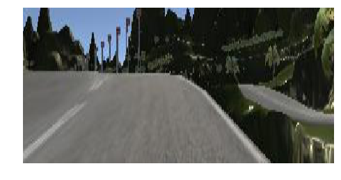
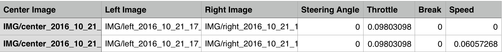

# **Behavioral Cloning Project**

 ### **with challenges**

The goals / steps of this project are the following:
* Use the simulator to collect data of good driving behavior
* Build, a convolution neural network in Keras that predicts steering angles from images
* Train and validate the model with a training and validation set
* Test that the model successfully drives around track one without leaving the road

The simulator is provided by Udacity. It has two modes:
* **training mode**: the car can be controlled through a keyboard or a game pad to generate data. More information about the data and it's structure can be found in the corresponding [section](https://github.com/pkern90/behavioral-cloning/blob/master/README.md#data). 

* **autonomous mode**: the car will receive it's input commands by the python script *drive.py*

The following animations show a shot of final model controlling the car on three different tracks.

Track 1               | Track 2(challenge1)   | Track 3 (challenge2)
:--------------------:|:---------------------:|:----------------------
  |   |

# Getting Started
---
### Prerequisites

This project requires **Python 3.5** and the following Python libraries installed:

- [NumPy](http://www.numpy.org/)
- [SciPy](https://www.scipy.org/)
- [matplotlib](http://matplotlib.org/)
- [pandas](http://pandas.pydata.org/)
- [TensorFlow](http://tensorflow.org)
- [Keras](https://keras.io/)
- [h5py](http://www.h5py.org/)

Only needed for driving in the simulator:

- [flask-socketio](https://flask-socketio.readthedocs.io/en/latest/)
- [eventlet](http://eventlet.net/)
- [pillow](https://python-pillow.org/)


## Run The Drive Script

The drive script needs the path to the model definition as argument. The definition has to be a json file generated by Keras. In addition the model weights have to be located at the same path like the model definition and has to have the same filename (except file type of course). So if all the necessary files (drive.py, model.json, model.h5) are in the same directory, the script can be executed with the following command:

```
python drive.py model.json
```
>The script will automatically connect to the simulator and send commands as soon as it's entering the autonomous mode.

## Retrain The Model

To retrain the model it's enough to execute the model.py script without any arguments. Some parameters are set as constants at the beginning of the script and can easily be modified for example to set the path to the training data. An overview of the constants is shown below with the default values.


```python
IMG_SIZE = [160, 320]
CROPPING = (54, 0, 0, 0)
SHIFT_OFFSET = 0.2
SHIFT_RANGE = 0.2

BATCH_SIZE = 128
#Patience for early stopping
PATIENCE = 3
#Maximal number of epochs. Might stop earlyer.
NB_EPOCH = 50

TRAINING_DATA_PATHS = ['data/track1_central/driving_log.csv',
                       'data/track1_recovery/driving_log.csv',
                       'data/track1_reverse/driving_log.csv',
                       'data/track1_recovery_reverse/driving_log.csv',
                       'data/track2_central/driving_log.csv']

VALIDATION_DATA_PATHS = ['data/track1_test/driving_log.csv',
                         'data/track2_test/driving_log.csv']
```

# Data Augmentation and Preprocessing
---
* Data

  the simulator recorded three images with a frequency of 10hz under "training mode". There are three cameras recording with an offset to the left,center and right respectively. 

  A following sample of the recorded images shown below:
  

Left                                   |  Center                   |  Right
:-------------------------------------:|:-----------------------------------------:|:-------------------------------------:
 | |

The simulator also created a log file while recording,each row in this sheet correlates image paths with corresponding **steering angle**, **throttle**, **brake**, and **speed** of the car. 


* Data exploratory

This histogram showed us that most values of steering angle were located at **0**.


This diagram indicated that there was more **right turns** than **left turns**, because more positive angle values(in radians) showed up there. 

As we see, the training data set contains a lot of 0 and right turn values of steering angle, thus generating additional data samples becomes more important to balance the data.

### Augmentation

* left/right angle adjustment

    I tested how to increase the left and right camera angles to match center panel data, and after lots of experimentations, I settled with using a shift of 0.25 rad on both sides, that is, the right camera would have to move 0.25 rad left to come to center and the left camera would have to right shift to 0.25 rad to come to center. Here is a figure presented the result after doing so.


---

* brightness augmentation

---


* translation augmentation

---


* adding shadow augmentation


### Putting All together and  Preprocessing


```python
def preprocessImage(image):
    shape=image.shape
    ##cropping image
    image=image[50:shape[0]-25,0:shape[1]]
    image=cv2.resize(image, (new_size_col,new_size_row),interpolation=cv2.INTER_AREA)
    return image

def preprocess_image_file_train(line_data):
    i_lrc=np.random.randint(3)
    if(i_lrc==0):
        path_file=line_data['left'][0].strip()
        shift_ang=.25
    if(i_lrc==1):
        path_file=line_data['center'][0].strip()
        shift_ang=0.
    if(i_lrc==2):
        path_file=line_data['right'][0].strip()
        shift_ang=-.25
        
    y_steer=line_data['steer_sm'][0]+shift_ang
    image=cv2.imread(path_file)
    image=cv2.cvtColor(image, cv2.COLOR_BGR2RGB)
    image,y_steer,tr_x=trans_image(image, y_steer,60)
    image=augment_brightness_camera_images(image)
    image=generateShadow(image)
    image=preprocessImage(image)
    image=np.array(image)
    
    ##randomly flip out input image
    ind_flip=np.random.randint(2)
    if ind_flip==0:
        image=cv2.flip(image,1)
        y_steer=-y_steer
    return image, y_steer
```

## Model Architecture


Here is my model architecture above for training the data. The first layer is 3 1X1 filters, this has the effect of transforming the color space of the images. As we do not know which one is the best color map apriori, using 3 1X1 filters allows the model to choose its best color map. This is followed by 4 convolutional blocks each comprised of 32 of filters of size 8X8, 64 of filters of size 8X8, 128 of filters of size 4X4 and 128 filters of size 2X2. These convolution layers were followed by 3 fully connected layers. All the convolution blocks and the following fully connected layers had relu as activation function.

### Training
During training the data by using keras generator with a batch size of 256 for 10 epochs, and in each epoch I generated 20000 images. Image inputs will be normalized to a range from -1 to 1 while feeding into the model. By implementing the generators, images will be randomly flipped, horizontally shifted and also cropped from the top by 25 pixels.

#### Reflection
This project challenged many aspects of what I have learned about deep learning so far. At the beginning, I increased more training data by just recording more of them, but found that the performance was still very poor, especially when the car was at a sharp turn, it would easily drive off the track. Then I tried to use the generator to purposely yield data with the different translation, brightness, and even adding some noises such as putting a shadow inside. Surprising, after 10 epochs of training, the model performed really well, as the car could successfully drive around the track.


```python

```
